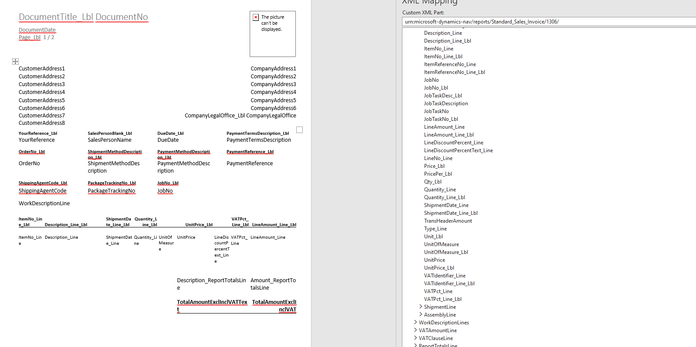
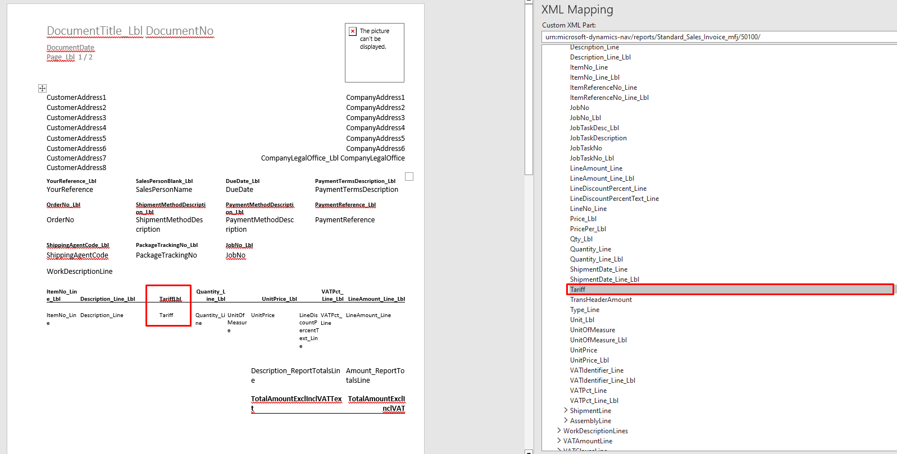

# Business Central Sales invoice Rapport No. 1306
Business Central Sales Invoice Rapport ID: 1306 with Tariff number added 

To get the tariff I made a copy of report 1306, and made sure it worked properly. \n
After that I pasted the tariff fields from report 1302 "Pro Forma report" into the new report

## Here we can see the standard word report without the tariff

## Here we can see the standard word report with the tariff

After publishing the extension we get the new report, 50100, but with extra fields. Namely tariff and tariffLbl

